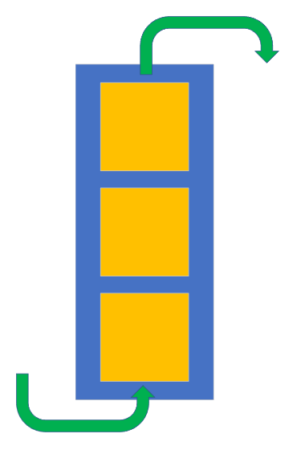

# Resilient Applications w/Queues, KEDA, and K8

## Resilient Applications w/Queues, KEDA, and K8
* Modern Applications receive a lot of different signals but must remain responsive to Users while also not losing track of everything that is going on.
* Applications must also deal with real limits on Resources.
  * Everything can't run at Maximum CPU/RAM and unlimited Replicas.
* Applications must stay up and maintain consistency even when parts may be over stressed or go down.
  * Not only do you not want to lose data but you also don't want to duplicate data if writes are retried or systems go in and out of sync.

## Problem
* Add your first bullet point here
* Add your second bullet point here
* Add your third bullet point here

## Current State
* Add your first bullet point here
* Add your second bullet point here
* Add your third bullet point here

## Queues
* First in/First out
* Allows Applications to decouple Submission of a Task from Handling the Completion of a Job
* Can be used to Distribute Work across Multiple Workers
* Can be Transactional
  * Read At Most Once vs At Least Once

## A few Use Cases for Queues
* Routing Notifications
* Triggering Tasks
* Recalculation Aggregations when New Data is loaded
* Buffer when one system can send tasks in batches faster than workers can handle.
* Retry or buffer when a dependent system is down.